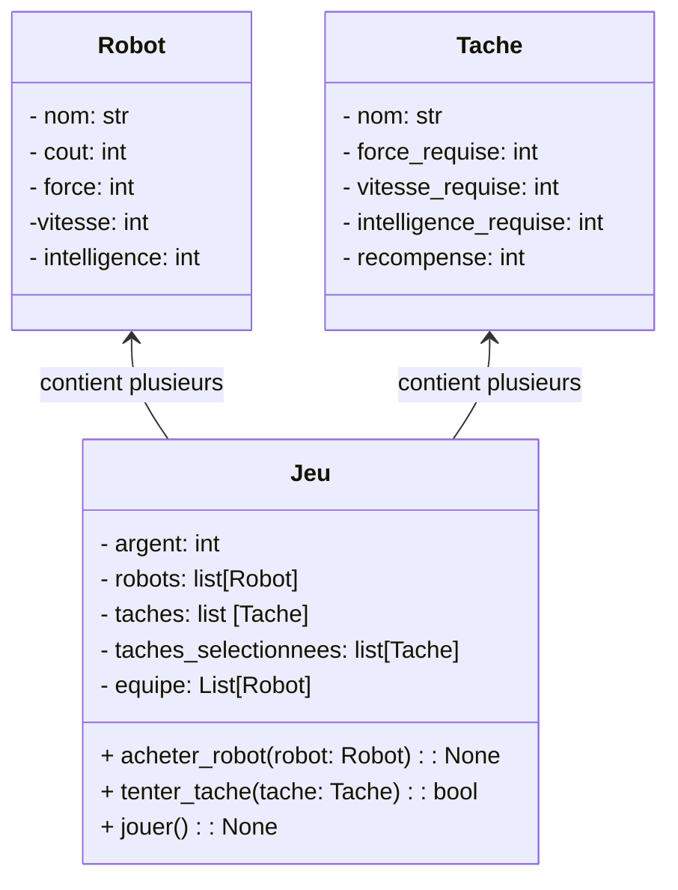
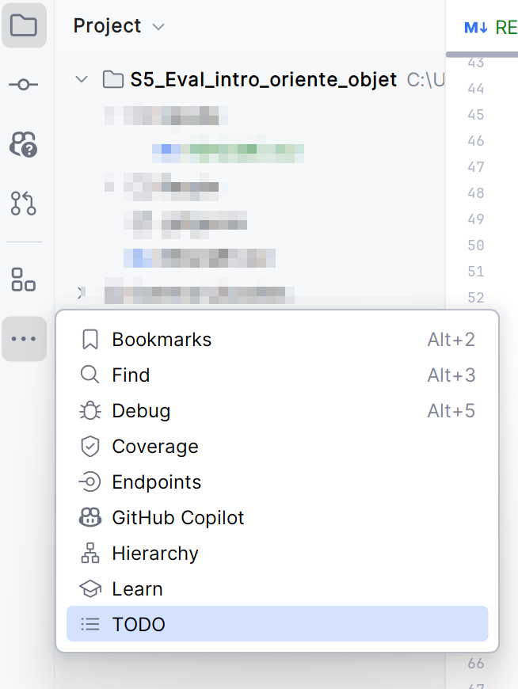

# Énoncé 
Une personne enseignante a eu une grande idée pour devenir millionaire ! 🤑💵💰

Créer un jeu vidéo avec des robots, de l'aventure, du hasard, de la stratégie et de l'argent.
Tous les éléments sont réunis pour faire un triomphe sur Steam ! 
Malheureusement, cette personne enseignante est un peu fatiguée, 
après avoir travaillé toute la journée puis s'être occupée des tâches domestiques, 
elle n'a pu terminer le code.

C'est là que vous lui portez secours, en échange d'une bonne note 💯, vous allez terminer le jeu.

# Tâches à accomplir
## Contexte

## Lire la description du jeu
>### Objectif du jeu : Construis la meilleure équipe de robots !
>Votre mission est d’assembler une équipe de robots en utilisant un budget initial. Vous devez réussir trois tâches spécifiques en achetant les bons robots tout en optimisant vos dépenses.

>### Déroulement du jeu
>1. **Début de la partie**
>- Vous recevez une somme d’argent de départ.
>- Une liste de dix robots disponibles à l’achat vous est présentée, chacun avec un coût et des caractéristiques (force, vitesse, intelligence).
>- Trois tâches aléatoires sont sélectionnées parmi une liste de tâches possibles.

>2. **Phase d’achat**
>- Vous pouvez acheter des robots en fonction de votre budget et des caractéristiques requises pour les tâches à accomplir.
>- Votre objectif est d’acheter les robots les plus adaptés sans gaspiller d’argent.

>3. **Phase d’exécution des tâches**
>- Une à une, les tâches sont tentées, il n'est plus possible de modifier votre équipe.
>- La réussite dépend des attributs cumulés de votre équipe.
>- Chaque tâche réussie rapporte une récompense en crédits.

>4. **Victoire ou défaite**
>- Si vous réussissez les trois tâches, vous gagnez la partie et votre score est déterminé par l’argent restant.
>- Si vous échouez, il faudra revoir votre stratégie !

>### Conseils
>- Pensez à bien équilibrer les caractéristiques de votre équipe.
>- Anticipez les tâches et gérez votre budget intelligemment.
>- Le choix des robots est crucial pour maximiser vos chances de succès.

>Bonne chance !

## Analyser le code
Analysez et complétez le code pour permettre à la personne enseignante de prendre sa retraite 🏖️ avec des millions en poches.

**Des tâches à faire ont été laissé en commentaire dans le code sous la forme de _TODOs_.**

## Valider grâce aux tests unitaires fournis
Le fichier **test_Jeu.py** possède des tests pour valider les deux méthodes à compléter.

> ⚠️ Ne focalisez pas sur les améliorations possibles au jeu. Effectuez uniquement les tâches (TODOs) demandées.