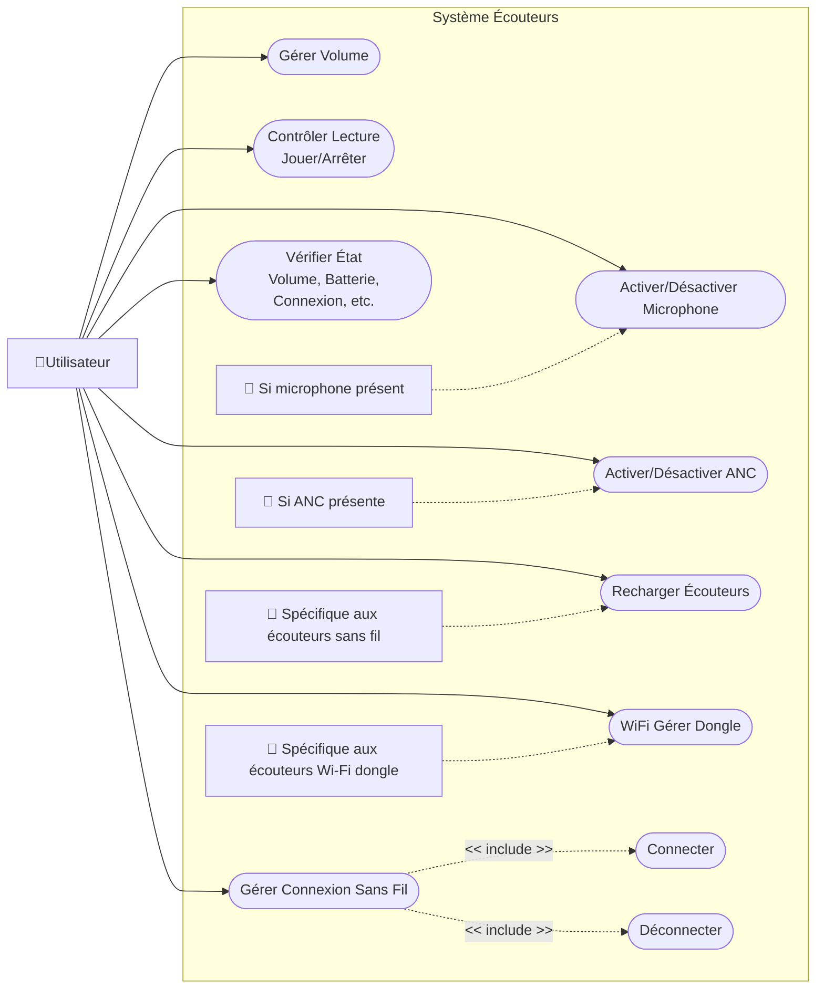

```mermaid
flowchart LR
    
    Actor[👤Utilisateur] --> UC1
    Actor --> UC2
    Actor --> UC3
    Actor --> UC4
    Actor --> UC5
    Actor --> UC6
    Actor --> UC7
    Actor --> UC8
    
    
    subgraph Système Écouteurs
        direction LR
        UC1([Gérer Volume])
        UC2([Contrôler Lecture\n Jouer/Arrêter])
        UC3([Gérer Connexion Sans Fil])
        UC4([Activer/Désactiver Microphone])
        UC5([Activer/Désactiver ANC])
        UC6([Vérifier État\n Volume, Batterie, Connexion, etc.])
        UC7([Recharger Écouteurs])
        UC8([WiFi Gérer Dongle])

        UC3 -.<< include >>.-> UC3a
        UC3 -.<< include >>.-> UC3b
        UC3a([Connecter])
        UC3b([Déconnecter])
           
           
        %% Notes simulées comme nœuds
        NoteUC4["📝 Si microphone présent"]
        NoteUC5["📝 Si ANC présente"]
        NoteUC7["📝 Spécifique aux écouteurs sans fil"]
        NoteUC8["📝 Spécifique aux écouteurs Wi-Fi dongle"]
    
        NoteUC4 -.-> UC4
        NoteUC5 -.-> UC5
        NoteUC7 -.-> UC7
        NoteUC8 -.-> UC8   
    end

    
```